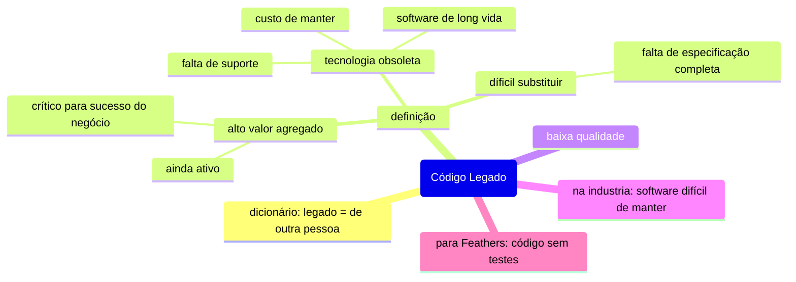

***Código legado***, ou *software legado*, é um termo bastante difundido na engenharia de software para se referir, em geral, a software produzido há muito tempo. No entanto, as características consideradas para determinar se uma base de código é legada vão além, cada time tem ideias próprias sobre o que torna uma base de código legada. Nesse artigo vou apresentar, na minha experiência, quais características são usadas para definir uma base de código legada.

## Definição

Por definição, *legado* é algo cuja responsabilidade foi transmitido de uma pessoa para outra, portando, podemos dizer que o termo ***código legado* se refere a código feito por outra pessoa** e repassado para nossa responsabilidade, mas, na prática, o termo assume um significado mais complexo e subjetivo. Para Pressman (2011, Pag. 36): "um software legado é caracterizado pela longevidade e criticidade de negócio". Em geral, três características se destacam ao se referir a *código legado*: **alto valor agregado**, **uso de tecnologia obsoleta** e **dificuldade de substituição**. 

### Alto valor agregado

Não se pode negar é que ***código legado* tem valor** - caso contrário seria descartado, ou arquivado -, são produtos que **"ainda estão em uso e desempenham um papel fundamental para o negócio"** (Sommerville, 2018, Pag. 237). 

### Tecnologia obsoleta

A maior fonte de frustração em lidar com *código legado* é a utilização de tecnologias obsoleta, isso frequentemente está ligado a *software de longa vida*, produtos concebidos há décadas atrás cujas **tecnologias em que foram construídos estão em desuso na indústria**. O uso dessas tecnologias torna a manutenção do software mais complexa e cara, devido a fatores como: falta suporte, de profissionais qualificados, de uma comunidade que produza conteúdo e ferramentas que auxiliem o desenvolvimento. Porém, mesmo software com menos de uma década de existência pode sofrer com tecnologias obsoletas.

Novas tecnologias são introduzidas no mercado o tempo todo, ao mesmo tempo que outras entram em desuso, perdem espaço e o interesse dos desenvolvedores, existem muitos casos de tecnologias que inicialmente pareciam promissoras, mas, o curto período de sucesso foi seguido de uma rápida queda na adoção. Esse é um risco que qualquer um tem que assumir ao adotar qualquer tecnologia, pois, é impossível prever quando tempo ela perdurará. 

### Difícil de substituir

Algo que contribui de forma definitiva para a existência de software legado é a dificuldade de o substituí-lo. Existem vários fatores para isso, ele pode ter um tamanho considerável e implementar um emaranhado complicado de regras que qualquer software que se proponha a substituí-lo deve implementar com exatidão, em muitos casos, a falta de uma especificação completa torna **as entranhas do software o único lugar onde se consegue obter o valioso conhecimento acumulado** de décadas de desenvolvimento incremental, muitas vezes testando o que funciona e o que não funciona, reunindo a experiências de vários colaboradores no decorrer de décadas de desenvolvimento contínuo. Portanto, qualquer tentativa de substituir envolveria a reengenharia do software existente - e toda a dificuldade envolvida nessa operação, como compreender o código de baixa qualidade ou escrito para uma tecnologia obsoleta.

## Baixa Qualidade

É muito comum fazer uma associação entre *código legado* e **baixa qualidade**, pois, em primeiro lugar, é muito provável que produtos em desenvolvimento há mais tempo tenham passado por várias modificações ao longo de sua vida, e que estas tenham tornado o código um emaranhado confuso de remendos produzidos por diversos desenvolvedores ao longo do tempo, degradando a qualidade. Isso é agravado por falhas na documentação dessas modificações e pela adoção de práticas e processos de desenvolvimento que hoje sabemos serem ineficientes. Em segundo, a dificuldade de manter e substituir um software está intrinsecamente ligada a aspectos relacionados a qualidade. 

## Software difícil de manter
  
As características discutidas até aqui convergem para uma coisa: *código legado* é difícil de manter. Tanto é que na indústria o termo é frequentemente empregado para se referir a uma base de código **difícil de compreender e modificar** (Feathers, 2013, Pag. viii). Em minha experiência, já vi equipes usarem o termo *código legado* de forma mais pejorativa do que prática, para definir **software que não se deseja dar manutenção**, às vezes por apresentar as características já citadas, mas às vezes sem aferir a qualidade ou implicações para o negócio, apenas por não seguir um novo padrão arquitetural. 

## Código sem Teste

Outra definição para *código legado* é apresentada por Feathers (2013): **"*código legado* é simplesmente código sem teste"**. Em resumo, ele relaciona *código legado* a código difícil de manter, como código sem testes é difícil de manter, logo ele é legado. Essa é uma forma muito ousada para definir *código legado*, mas, apesar de achar a ideia muito interessante, levanta alguns questionamentos, a final teste também é código e, portanto, passível de se tornar legado.

## Conclusão

Em minha experiência, o termo *código legado* é empregado para destacar a presença de características específicas em uma base de código, cada equipe tem suas próprias definições sobre quais características definem um código como legado, mas geralmente elas convergem para um código difícil, ou que não se deseje, manter e compreender. No entanto, mais importante do que definir o que é *código legado* é definir o que fazer com ele, a final ele ainda tem valor, e em muitos casos é peça-chave para o sucesso do negócio.

## Referências

FEATHERS, Michael. Trabalhando eficaz com código legado. Editora Bookman, 2013.
PRESSMAN, Roger S. Engenharia de Software: Uma abordagem profissional 7ª ed. AMGH Editora Ltda, 2011
SOMMERVILLE, Ian. Engenharia de Software 10ª ed. Pearson Education do Brasil,2018